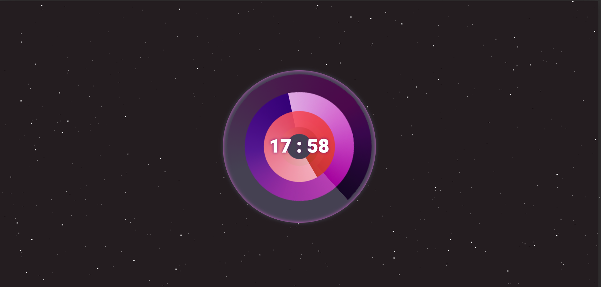

## 網頁計時器 | 客製化時鐘
[DEMO](https://vina2325.github.io/clock/clock/clock.html "Title") 

### 創作理念
用色彩漸變的意象表徵時間的流動 
取代傳統秒針、分針，與時針的制式化樣貌 
並將時鐘放置在無垠的宇宙中，使其不被空間所限制

### 使用技術
<ul>
<li>javascript DOM 的操作和計時器</li>
<li>CSS動畫</li>
<li>Photoshop畫面處理</li>
</ul>
